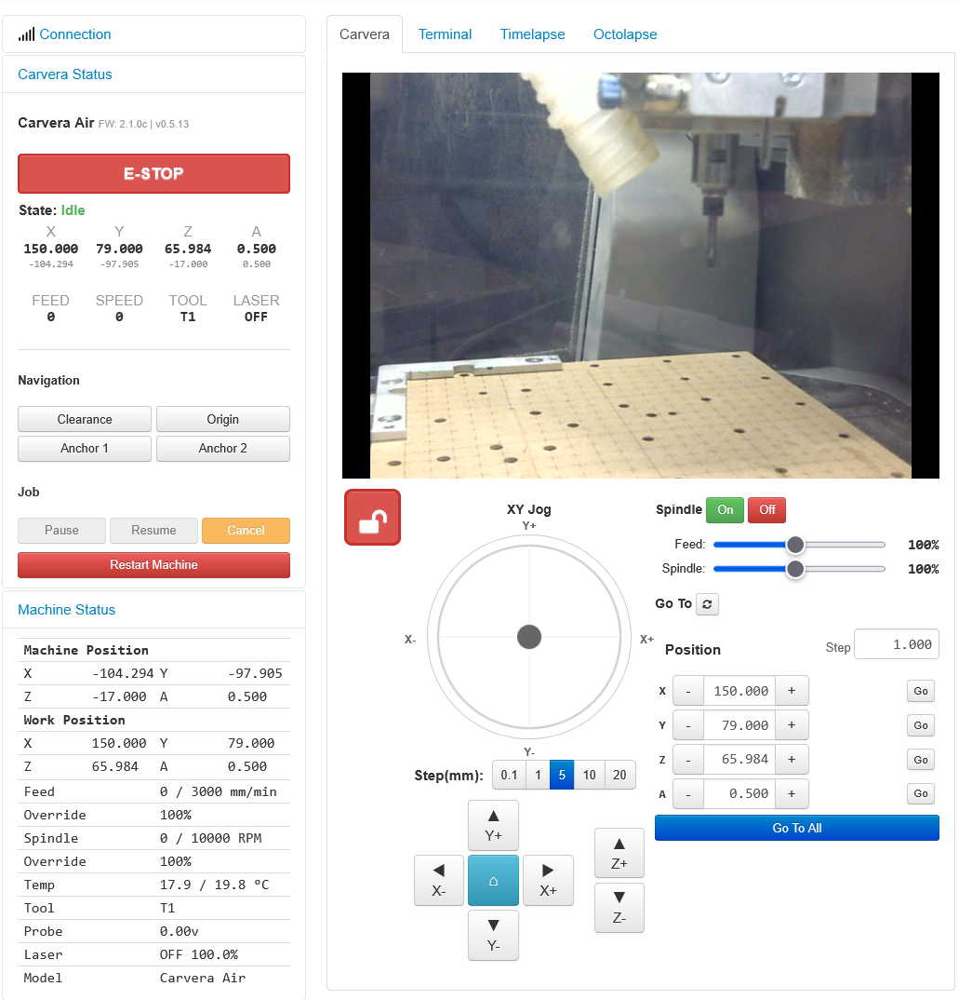

# OctoCarvera

OctoPrint plugin for monitoring and controlling the **Carvera** and **Carvera Air** CNC machine over USB serial.



## What Is This?

OctoCarvera connects your Carvera and Carvera Air to [OctoPrint](https://octoprint.org), giving you access to the mature OctoPrint ecosystem for remote monitoring. View your machine from your phone, watch jobs via webcam, get notifications, and expose machine data to Home Assistant via MQTT — all without replacing the Carvera Controller app.

**This plugin is a companion, not a replacement.** The Carvera Controller app remains the primary tool for homing, calibration, tool changes, and job setup. OctoCarvera adds remote visibility and basic controls on top.

## Features

- **Real-time monitoring** — Live position (WPos + MPos), feed rate, spindle speed, tool number, laser status, and machine state at 0.3s without polling. Some polling is done to keep octoprint happy, but this is default at 10s and configurable.
- **Job control** — Pause, resume, and cancel running jobs with job progress display (percent + elapsed time)
- **Jog controls** — XY knob, direction buttons, Z slider with step sizes, jog lock toggle
- **Navigation presets** — Clearance, work origin, anchor 1, anchor 2
- **Spindle control** — On/off with safety guard (blocks spindle when no cutting tool loaded)
- **Feed & spindle overrides** — Real-time override sliders
- **File management** — Browse Carvera SD card, upload files via XMODEM, create folders, rename/move/delete files
- **MQTT / Home Assistant** — Publish machine state, positions, and sensor data for HA auto-discovery (requires [OctoPrint-MQTT](https://github.com/OctoPrint/OctoPrint-MQTT) plugin)
- **Webcam** — Use OctoPrint's built-in webcam support to watch your machine remotely
- **Activity-based UI** — Buttons enable/disable based on machine state (idle, jogging, running, paused, alarm)

## Compatibility

| Component | Supported |
|-----------|-----------|
| **Carvera Air** | Yes (primary target) |
| **Carvera (original)** | Should work — same protocol, not tested |
| **Stock firmware** | <= 1.0.3 (plain text protocol) |
| **Stock firmware 1.0.5+** | Binary protocol — decoded but plugin support pending |
| **Community firmware** | 2.0.x, 2.1.x (plain text protocol) |
| **OctoPrint** | 1.9+ (tested on 1.11.7) |
| **Python** | 3.7+ |
| **Connection** | USB serial only (FTDI 232R, 115200 baud) |

## Installation

### On OctoPi / Raspberry Pi

```bash
# SSH into your Pi
ssh user@your-pi-ip

# Install from source
cd /tmp
git clone https://github.com/JorgenSteen/octoprint-octocarvera.git
cd octoprint-octocarvera
~/oprint/bin/pip install .

# Restart OctoPrint
sudo systemctl restart octoprint
```

### Settings

After installation, go to **OctoPrint Settings > OctoCarvera**:

- **Machine Name** — Display name, also used as MQTT topic segment
- **Serial Protocol** — Plain Text for community/stock <= 1.0.3, Binary for stock 1.0.5+
- **Override Mode** — Auto-detect (recommended), or manually select community/stock
- **Publish to MQTT** — Enable to publish machine data to Home Assistant (requires OctoPrint-MQTT plugin configured with your broker)

### Connecting

1. Connect the Carvera Air to the Pi via USB cable
2. In OctoPrint, select the serial port (`/dev/ttyUSB0`) and baud rate `115200`
3. Click Connect
4. The plugin auto-clears the DTR-induced Alarm on connect. If you've disabled `auto_unlock_on_connect` in settings, click **Unlock** in the sidebar instead.

### Raspberry Pi cold-boot notes

When the Pi and Carvera power on simultaneously (e.g. after a power outage), a couple of OS-level things on the Pi can send extra noise at the Carvera while it's still booting. The plugin's auto-unlock handles the resulting Alarm, but it's still worth quieting the Pi side:

- **Disable ModemManager** — it probes `/dev/ttyACM*` on enumeration and sends AT bytes that the Carvera doesn't appreciate:
  ```
  sudo systemctl mask ModemManager
  ```
- **Add a udev rule** as a belt-and-braces measure (works even if ModemManager is reinstalled later). Replace the VID/PID with the values reported by `lsusb` for your Carvera:
  ```
  # /etc/udev/rules.d/99-carvera-no-mm.rules
  SUBSYSTEM=="tty", ATTRS{idVendor}=="0403", ATTRS{idProduct}=="6001", ENV{ID_MM_DEVICE_IGNORE}="1"
  ```
  Then reload: `sudo udevadm control --reload && sudo udevadm trigger`

The kernel still asserts DTR on USB-CDC-ACM/FTDI port open — that's a Linux-wide behavior that can't be suppressed from userspace, which is why the plugin's auto-`$X` is the actual fix.

## Usage

OctoCarvera adds several UI sections to OctoPrint:

- **Carvera Status** (sidebar) — E-stop, state, positions, indicators, navigation, job controls
- **Machine Status** (sidebar) — Detailed machine data: overrides, temperatures, probe voltage, job progress
- **Carvera** (tab) — Jog controls, spindle on/off, feed/spindle override sliders
- **Carvera Files** (sidebar) — Browse and manage files on the Carvera's SD card

### Typical Workflow

1. Set up your job in **Carvera Controller** (homing, tool selection, work origin, generating G-code)
2. Start the job from Carvera Controller or upload files via OctoCarvera
3. Monitor progress remotely via OctoPrint (phone, tablet, desktop)
4. Use pause/resume/cancel if needed
5. Check on the machine via webcam

## Important Notes

- **Never start the spindle without a cutting tool loaded** — The plugin blocks this (T1-T100 required), but always verify physically
- **Homing and calibration** must be done from the Carvera Controller app
- **Tool changes** must be done from the Carvera Controller app
- **The Carvera Controller app uses WiFi, OctoCarvera uses USB** — both can coexist without conflict

## Installation

Install via OctoPrint's Plugin Manager:

1. Open OctoPrint Settings > Plugin Manager > Get More
2. Paste this URL: `https://github.com/JorgenSteen/octoprint-octocarvera/archive/main.zip`
3. Click Install
4. Restart OctoPrint

Or install manually:

```bash
~/oprint/bin/pip install "https://github.com/JorgenSteen/octoprint-octocarvera/archive/main.zip"
```

## License

AGPL-3.0. See [LICENSE](LICENSE) for details.
